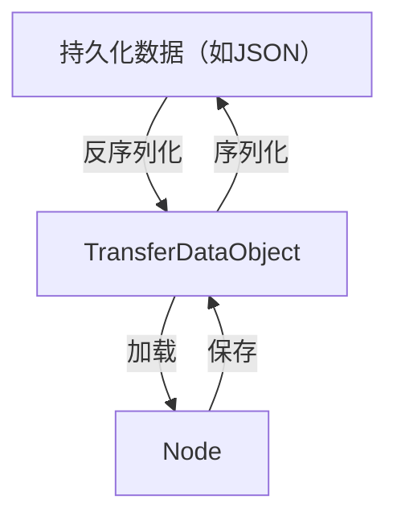

# 项目架构设计

本项目采用基于 **Turborepo + pnpm workspace** 的 **monorepo** 方式进行管理，以有
效解决多包之间的依赖问题，提升开发效率和代码复用性。项目结构清晰，主要分为三个核
心目录：`packages`、`apps` 和 `plugins`。

- **`packages`**: 存放所有**核心**、**可复用**的代码包，每个包都是一个独立的 npm
  包，可以单独发布和使用。这些包提供了编辑器的基础功能和通用组件。
- **`apps`**: 存放所有**应用级**的项目，例如 MixEditor 的文档、在线演示环境
  (playground) 等。这些应用依赖于 `packages` 中的核心包构建。
- **`plugins`**: 存放所有**插件**，每个插件都是一个独立的 npm 包，用于扩展编辑器
  的功能。插件可以依赖 `packages` 中的核心包，并注册到 `@mixeditor/core` 中，从
  而增强编辑器的能力。

此外，`docs` 文件夹用于存放项目的所有文档，包括设计文档、API 文档、使用教程等。

**目录结构概览：**

```
mixeditor/
├── apps/
│   ├── docs/         # MixEditor 文档站点
│   └── playground/   # MixEditor 在线演练场
├── packages/
│   ├── core/         # 编辑器核心逻辑 (@mixeditor/core)
│   ├── browser-view/ # 浏览器渲染层 (@mixeditor/browser-view)
│   └── ...           # 其他核心包
├── plugins/
│   ├── plugin-a/     # 插件 A (@mixeditor/plugin-a)
│   ├── plugin-b/     # 插件 B (@mixeditor/plugin-b)
│   └── ...           # 其他插件
└── docs/             # 项目文档
    ├── design.md     # 设计文档
    ├── api.md        # API 文档
    └── ...
```
# 目标
富文本编辑器最佳解决方案。

# 步骤

## 1. 设计核心架构
本节讲述 `@mixeditor/core` 的设计。`@mixeditor/core` 采用大量有向无环图的设计，以解决存在大量插件时，流程的顺序正确问题。
### 宏观架构
插件一等公民设计。
* 依赖图关系：插件组成有向无环图，每个插件依赖上级的接口，为下级提供自己的接口。
* 固有内容暴露：插件的接口应确保能提供更改插件固有内容的能力。
### 微观架构
#### 节点
`Node` （节点）是内容单元，记录自身的类型和状态。
`NodeManager` 是节点的管理器，负责管理如下内容：
* 储存和提供节点处理器。节点处理器定义了某种类型的节点的特定行为，例如文本节点的 `get_child`（获取子节点） 行为。
#### 操作
`Operation`（操作）是编辑器节点树可跟踪的变更记录，记录了自身的 id、类型、数据等元信息。
`OperationManager` 是操作的管理器，负责管理如下内容：
* 储存和提供操作处理器。操作处理器定义了某种类型的操作的特定行为，例如插入文本操作的 `execute` 和 `undo`（执行和撤销） 行为。
`HistoryManager` 是操作历史的管理器，负责跟踪历史记录，提供执行、撤销和取消等多种行为。另外还提供事务支持，可以在执行批量操作出错时自动回滚。
#### 事件
`Event`（事件）描述了一次通知的内容，记录了自身的类型、内容和上下文。
`EventManager` 是事件的管理器，负责管理如下内容：
* 储存和触发事件处理器。在注册事件处理器时，可以设置自己在哪个监听器之后触发。在触发事件时，事件传播是广播的。冒泡/捕获的责任链机制应当由事件处理器自己实现。
#### 选区
用户对节点的更改围绕着选区而进行。
`Selection`（选区）记录 `Selected`（选区信息）。
`Selected` 记录选区类型、选区范围等信息，共有两种选区类型：
* `CollapsedSelected`：折叠选择，仅选择一个节点。
* `ExtendedSelected`：扩展选择，选择了以两个节点为界之间的所有节点。
#### 保存器
`Saver`（保存器）负责管理以下内容：
* 储存和提供加载器。加载器用于将 `TransferDataObject` 转换为 `Node`。
* 提供加载和保存接口。提供 `TransferDataObject` 和  `Node` 双向转换的接口。
* 储存和提供序列化和反序列化器。序列化和反序列化器用于将 `TransferDataObject` 和持久化数据（如JSON、HTML）相互转换。

`TransferDataObject`（传输对象）是一个接口，是用于持久化的中间格式，要求目标是个 JS 对象且具有 `type` 键。每个节点都应该有其对应的传输对象。

持久化数据、传输对象和节点按如下方式转换

### 整体流程
1. 事件、操作和节点的关系：事件触发事件处理器，事件处理器通常是通过责任链，逐个节点调用节点处理器以查找待处理的节点，而节点处理器产生和执行操作。
	例如：用户触发了输入文本事件，输入文本事件的监听器包含寻找处理输入文本事件节点的责任链，查找成功后，节点的责任链处理器将输入文本操作在  `HistoryManager` 上推送并执行。


## 2. 设计浏览器视图架构
本节讲述 `@mixeditor/browser-view` 的设计。
### 结构
`NodeRendererManager` 管理节点渲染相关的事务，具体为如下内容：
* 储存和提供节点渲染器。节点渲染器应当返回一个 DOM Node，如果节点渲染器有子节点，应当调用 `NodeRendererWrapper` 进行渲染。

`NodeRendererWrapper` 是带缓存的节点渲染器调用器。它会缓存节点初次渲染产生的 DOM Node，在后续的重复渲染中使用缓存以节省渲染开销。

`EditorRenderer` 是编辑器的渲染入口层，负责充当事件总线和渲染 `ContentRenderer`、`SelectionRenderer`。
* `ContentRenderer` 负责渲染内容，从根节点（Document）开始渲染。
* `SelectionRenderer` 负责渲染选区。
### 渲染方案
浏览器视图依赖 SolidJS 进行 DOM 渲染。


## 3. 稳定核心架构
通过 core、browser-view、plugin-basic-text、plugin-text-style 插件的组合，做出最小可用成品。

未解决的问题：
* 扩展选区的渲染（节点）。
* 输入文本的责任链。输入文本时，应当触发文本输入事件。事件管理器调用文本输入处理的责任链，责任链应当从当前选区的节点开始：
  * 如果选区是折叠选区，则从选区的节点开始。
  * 如果选区是扩展选区，则从选区的起始节点开始。并先删除选区范围内的节点或内容。

  不断按照责任链查找，直到找到待处理的节点。

* 光标的左右移动。按下键盘左右箭头键时，应当触发光标移动事件。事件管理器调用光标移动处理的责任链，责任链应当从当前选区的节点开始：
  * 如果选区是折叠选区，则从选区的节点开始。
  * 如果选区是扩展选区，则从选区的起始节点开始。

  不断按照责任链查找，直到找到待处理的节点。

